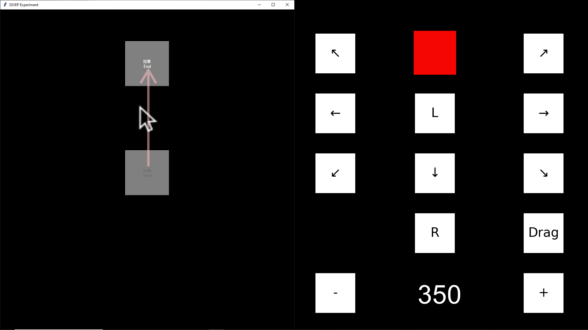

# uniBrain Speller

## Introduction

Brain-computer interfaces (BCIs) are at the forefront of human-computer interaction, yet many lack user-centric software. We've developed a unified BCI software platform addressing this gap, streamlining everything from data acquisition to command output. 

<p align="center">
  
</p>

Utilizing the Steady-State Visual Evoked Potential (SSVEP) paradigm, our software achieves a Fitts’ transmission rate of 0.275 bps initially. Further, the Task-Related Component Analysis (TRCA) on our spelling keyboard hits a peak performance of 169.30±13.89 bpm within 0.3 seconds. Our research also highlights BCI's positive impact on perceptual psychology, with key metrics like usage window length correlating with enhanced user agency and body perception. The platform offers tailored BCI interactions, adaptable to diverse needs, from medical applications to entertainment. Embracing open-source principles, our software garners acclaim from the academic and medical communities.

## Features

- **User Information Management**: Manage personal details effortlessly with uniBrain Speller's dedicated interface for a tailored BCI experience.

- **Customizable Keyboard Interface**: Modify **keyboard layout**, **font size**, and **block size** as needed. Instantly preview changes to ensure the best user interaction.

- **Hardware and Processing Parameters**: Set up the **eeg collection system** accurately for seamless software performance. The processing interface offers varied modes and settings for optimal BCI tuning.

- **Stable SSVEP Paradigm**: Benefit from the reliable Steady-State Visual Evoked Potential (SSVEP) BCI paradigm for consistent brain-computer interactions.

- **Advanced Algorithms**: Opt between the trained (TRCA) and untrained (fbCCA) algorithms, catering to different signal processing needs.

- **Highly Adaptable**: uniBrain Speller is versatile, suitable for medical, research, or entertainment purposes, ensuring a BCI method that fits all user requirements.

## Installation

### Prerequisites
- **Development Environment**: Ensure you have Python 3.8 installed on your system. If not, you can download and install it from the [official Python website](https://www.python.org/downloads/).

### Installation Steps
1. Clone the repository or download the source code to your local machine.
2. Navigate to the directory containing the `requirements.txt` file.
3. Run the following command to install the necessary packages:
   ```
   pip install -r requirements.txt
   ```
4. Additionally, for some specific functionalities, you might need to install packages from statsmodel. Execute the following command:
   ```
   pip install git+https://github.com/statsmodels/statsmodels
   ```

After completing these steps, you should have all the necessary dependencies installed and be ready to use the software.

## Usage

### 1. User Information Input
Start by entering the basic user information to tailor the experience to the individual user.

当然可以，我为您调整了图片的大小，使其涵盖半个总宽度：

### 2. Keyboard Selection and Customization
- Choose your desired keyboard. Each keyboard has specific functionalities.
- The default settings allow for mouse control and typing.
  
  
  

- You can freely edit the position, output functions, and flicker parameters based on your preferences.

  

- For those who wish to add more functionalities, you can also add preset keyboards.
- To ensure stable flickering, it's recommended to choose the half-screen option.

  
**Illustrations**:
### 3. Dual-Host Synchronization
Ensure you have two systems set up:
- One system runs our software.
- The other system operates with Curry (software) combined with Neuroscan for real-time data collection.

### 4. Algorithm Selection
- You have the option to choose between trained algorithms like TRCA or untrained algorithms like fbCCA.
- We welcome contributors to add more algorithms to this repository.

### 5. Training and Testing
- If you opt for the TRCA training algorithm, you'll need to undergo at least three blocks of training before accessing the Test and Use features.
- If you're using an untrained algorithm, you can directly proceed to use the software.

希望这样可以满足您的需求！

## Contributing

We welcome contributions from the community! If you're interested in enhancing the functionalities or have suggestions, feel free to make a pull request or open an issue.

### Main Developers:
- [**Shi Nan-Lin**](https://github.com/ShinlDiego) (THU)
- [**Teh Kah Hann**](https://github.com/Kahhann92) (THU)

We appreciate the hard work and dedication of our main developers and the entire community that supports this project.

## License

Include any relevant licensing information for your project, and provide a link to the full license text if needed.

## Acknowledgments

List any individuals, organizations, or resources that have contributed to your project or have inspired its creation.
